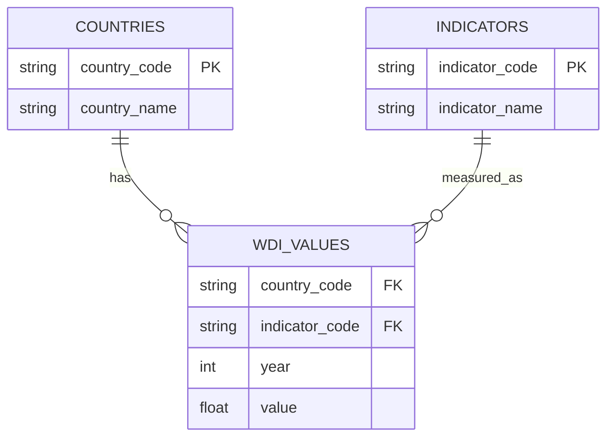

# Entity–Relationship diagram

```mermaid
erDiagram
    COUNTRIES {
        string country_code PK
        string country_name
    }

    INDICATORS {
        string indicator_code PK
        string indicator_name
    }

    WDI_VALUES {
        string country_code FK
        string indicator_code FK
        int year
        float value
    }

    COUNTRIES ||--o{ WDI_VALUES : has
    INDICATORS ||--o{ WDI_VALUES : measured_as

```